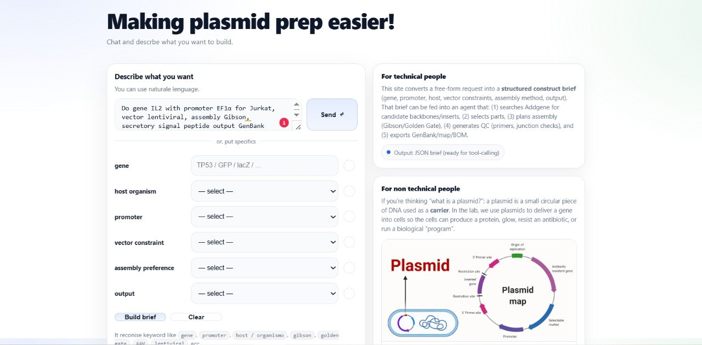
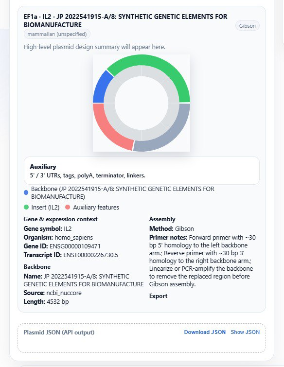
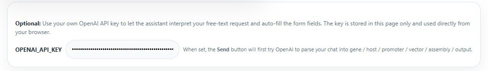
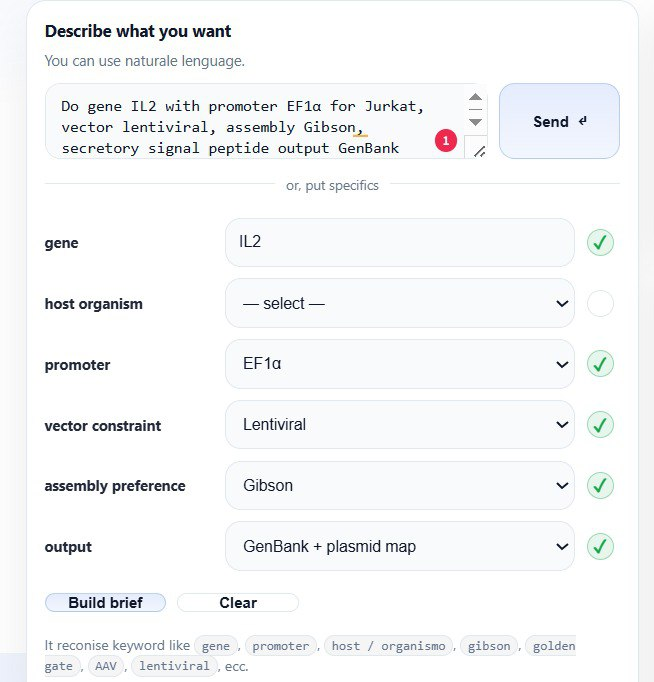

# 🧬 Plasmid Pipeline Multi-Agent Example (Python)

This project is a **multi-agent plasmid design pipeline** written in Python. It turns imprecise, natural-language biological requests into machine-readable build plans.

### * Example Input
> “Build a TP53 expression plasmid for HEK cells with a CMV promoter using Gibson assembly”



The pipeline converts this into structured output for downstream laboratory tools.




---

## # What the project does

The pipeline acts as the intelligent layer between a user interface and plasmid design logic.

### * Key Tasks:
* **Requirement Extraction:** Identifying gene, host, promoter, and assembly method.
* **Backbone Selection:** Suggesting the best vector for the job.
* **Construct Briefing:** Generating plasmid map data and primer lists.
* **Data Export:** Returning a full JSON payload for manufacturing.




---

## # Run the project

To start the main pipeline:
```bash
python -m plasmid_pipeline.orchestrator
* Python version
Use Python 3.10+ (3.11 or 3.12 is recommended).

It is recommended to use a clean virtual environment.

* Create and activate a virtual environment
macOS / Linux
Bash
cd a2a-python-test
python3 -m venv venv
source venv/bin/activate
# To deactivate: deactivate
Windows (PowerShell)
PowerShell
cd a2a-python-test
python -m venv venv
.\venv\Scripts\Activate.ps1
# To deactivate: deactivate
Note: If PowerShell blocks execution, run: Set-ExecutionPolicy -Scope CurrentUser RemoteSigned

# Install dependencies
With your environment active, run:

Bash
pip install -r requirements.txt
This installs: a2a-sdk, python-dotenv, openai, uvicorn, and httpx.

# Environment variables
You must provide an OpenAI API Key to power the agents.

macOS / Linux: export OPENAI_API_KEY="sk-..."

Windows (PS): $env:OPENAI_API_KEY="sk-..."

.env file: Create a .env in the root and add OPENAI_API_KEY=sk-...

# Project architecture
This is a Multi-Agent System (MAS):

Orchestrator: Coordinates the workflow.

Specialized Agents: Handle subtasks like backbone selection and QC.

* Running the agent servers
Open four separate terminals and run:

Terminal 1 – Orchestrator:
python -m agents.orchestrator_agent.main --port 9090

Terminal 2 – Design Sub-agent:
python -m agents.design_agent.main --port 9101

Terminal 3 – Backbone Sub-agent:
python -m agents.backbone_agent.main --port 9102

Terminal 4 – QC Sub-agent:
python -m agents.risk_agent.main --port 9103

[!TIP]
Ensure you rename any legacy module names (like crypto_agent) to biological names (like design_agent) to keep the repo readable!

# Running the client
Open a final terminal to send a request:

Bash
python -m client.main --card-url [http://127.0.0.1:9090](http://127.0.0.1:9090) --log agent_conversation.log
* Example Structured Output
JSON
{
  "gene": "TP53",
  "host": "mammalian",
  "promoter": "CMV",
  "vector_constraint": "plasmid",
  "assembly_preference": "gibson",
  "output": "genbank"
}
# Logs and conversation history
Check agent_conversation.log to see how the agents "talked" to each other to solve the request:

client → orchestrator

orchestrator → sub-agent

sub-agent → orchestrator

orchestrator → client
